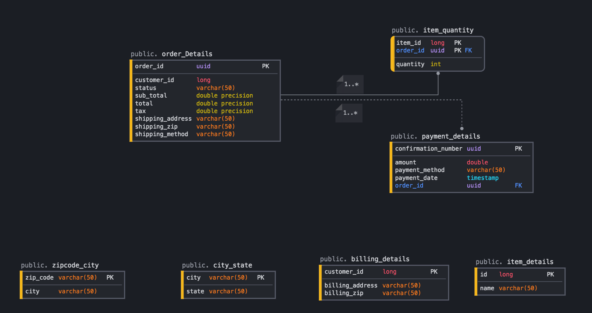

# Order Processing Service

This is a Spring Boot microservice which handles processing of orders placed by a customer. It uses PostgreSQL database inorder to store order details.

To run the app locally :
------------------------
1. Once cloned the app, run `mvn clean install`
2. Run the `OrderProcessingServiceApplication.java`
3. Load `http://localhost:8080/swagger-ui/` in the browser.

PostgreSQL database setup :
---------------------------
1. Use pgAdmin4, a GUI tool to view the data.
2. Set `username = postgres`
     & `password = password` (should be same as the one's used in `application.properties` file).
3. Create a database with the name `orders`.

To run the app locally using docker :
-------------------------------------
1. Once cloned the app, run `mvn clean install`
2. Use the command `docker build -t order-processing-service .` to build the image from the generated jar.
3. Use the command `docker-compose up` to get the container up & running.
4. Load `http://localhost:9090/swagger-ui/` in the browser.

#### Sample RequestBody for `POST /api/orders` :
```{
  "order": {
    "items": [
      {
        "itemId": 12,
        "orderItemName": "item-3",
        "orderItemQty": 2
      },
      {
        "itemId": 11,
        "orderItemName": "item-2",
        "orderItemQty": 1
      }
    ],
    "orderStatus" : "ACTIVE",
    "orderSubtotal" : 125,
    "orderCustomerId" : 999,
    "orderTotal" : 140,
    "orderTax" : 15,
    "billingAddress": {
      "line1": "APT-506",
      "city": "Chicago",
      "state": "IL",
      "zip": "60657"
    },
    "shippingAddress": {
      "line1": "APT-507",
      "city": "NYC",
      "state": "NY",
      "zip": "07032"
    },
    "paymentInfoDetails" : [
       {
          "paymentMethod" : "CARD",
          "amount" : 20
       },
      {
          "paymentMethod" : "CASH",
          "amount" : 200
       }
    ],
    "orderPaymentDate" : "2020-12-24",
    "shippingMethod" : "SHIP_TO_HOME"
  }
}
```
##### **NOTE :**
1. Use the `orderId` returned in the response for the above `POST` request, for `GET /api/order/{orderId}` to get order details by `orderId` and `PUT /api/order/{orderId}` to cancel an order by `orderId`.
2. Use the `customerId` provided in the above `POST` request body for, `GET /api/orders/{customerId}` to fetch all the orders placed by the customer with `customerId`.

#### Database Schema :


